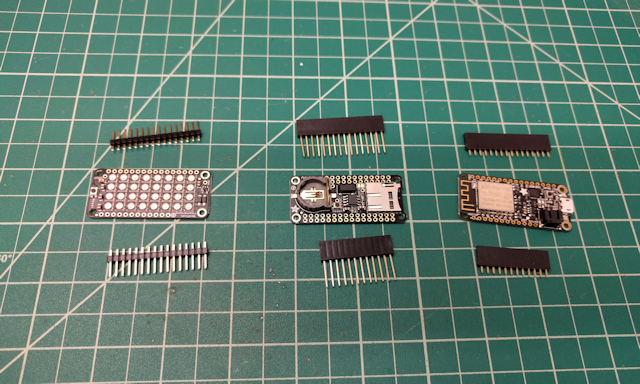

# Arduino Glowing Pumpkin (Feather, Timer)

<!-- toc -->

* [Introduction](#introduction)
* [Component List](#component-list)
* [Assembly](#assembly)
* [Application Code](#application-code)

<!-- toc stop -->

## Introduction

Last year, I created a cool [Arduino-powered Glowing Pumpkin](https://github.com/johnwargo/Arduino-Glowing-Pumpkin) project for Halloween. I used a Neopixel ring and an Arduino to display random colors inside a foam pumpkin. I built several of them, and placed one in each dormer window in my house. they work great, but I've always wanted to do something bigger, but I never found a big enough pumpkin to use for this. This year, while picking up some supplies at Home Depot, I found the perfect pumpkin for an updated version of the project.

With this new, huge pumpkin project, I decided to merge two existing projects into one. For this project, the Arduino board I selected was the Adafruit Feather, a Wi-Fi enabled board that I could use to add some Internet connectivity to the project. with that in mind, I took the glowing pumpkin code from the earlier project and added it to the code from my [Arduino RTC Relay Static](https://github.com/johnwargo/arduino-rtc-relay-static) project. This allowed me to turn the pumpkin on and off on a schedule, and use the board's Wi-Fi connectivity to get the correct time from an Internet Time Server. I even added a real-time clock board to the project so I could store the time in the board in case the Wi-Fi network wasn't available at startup.   

For lighting, I had to think bigger. Since this was a much larger pumpkin to illuminate, I had to go beyond the simple Neopixel ring. For this project, I used the Adafruit Neopixel FeatherWing, a 8x4 array of bright, tri-color LEDs. As you can see from the following picture, it's a pretty big pumpkin; that's a quart paint can to the right of it.

## Component List

For this project, I used the following hardware:

+ [Adafruit Feather HUZZAH with ESP8266 WiF](https://www.adafruit.com/product/2821)
+ [Adalogger FeatherWing - RTC](https://www.adafruit.com/product/2922)
+ [NeoPixel FeatherWing](https://www.adafruit.com/product/2945)
+ [Feather Header Kit - 12-pin and 16-pin Female Header Set](https://www.adafruit.com/product/2886)
+ [Feather Stacking Headers - 12-pin and 16-pin female headers](https://www.adafruit.com/product/2830)
+ [5V 2.4A Switching Power Supply with 20AWG MicroUSB Cable](https://www.adafruit.com/product/1995)
+ A huge, plastic pumpkin
+ Strips of self-adhesive Velcro 
+ One 2' x 2' piece of 3/4 in plywood, painted black

## Assembly

Assembling the project is easy since all of the components stack on top of each other. When you're done, you'll stack the components together with the Feather on the bottom, the Adalogger in the middle, and the NeoPixel FeatherWing on top (you want the LEDs clearly visible on top of the stack).

+ Solder the female headers on the Feather board
+ Solder the stacking headers on the Adalogger board
+ Solder the male headers that come with the Feather board to the NeoPixel FeatherWing

When you're done, you should be able to stack the components together like this:

 

## Application Code

The application's `setup` function initializes the NeoPixel array and the random number generator. 

	void setup() {
	  // This is for Trinket 5V 16MHz, you can remove these three lines if you are not using a Trinket
	  #if defined (__AVR_ATtiny85__)
	    if (F_CPU == 16000000) clock_prescale_set(clock_div_1);
	  #endif
	  // End of trinket special code

	  // Initialize the NeoPixel library
	  pixels.begin();
	  // show any lights that should be on (in this case, none)
	  pixels.show();
	
	  //Initialize the random number generator with a random seed pulled from
	  //analog pin #3
	  randomSeed(analogRead(3));
	}

The main loop in the application picks a number between 0 and 10, and if the number is greater than 8, it kicks off the `flicker()` function (described later). If less than 8, it picks a random color from the colors array and calls the `rotateLights()` function to cycle the ring's LEDs to the selected color.  

	void loop() {
	  //generate a random integer between 1 and 10
	  //if it's a 9 or a 10, ...
	  if ((int)random(11) > 8) {
	    //do that flicker thing
	    flicker();
	  } else {
	    //otherwise, pick a random color and set each pixel individually to that color
	    //with a random time delay between setting each pixel       
	    stepLights(colors[(int)random(1, numColors + 1)], (int)random(50, 500));
	  }
	}

The `flicker()` function sets the ring's LEDs to white then flickers them a random number of times, each for a random duration. The `flashCount` variable is set to an integer between 1 and 7 then  used as a loop counter for the flashes. The function sets a random value that controls how long the lights stay on as well as another random value to control how long of a pause there is between flashes. The end result is that it looks like a short or something is causing a white spark every so often. Pretty cool, eh?

	void flicker() {
	  // how many times are we going to flash?
	  int flashCount = (int)random(1, 7);
	  //flash the lights in white flashCount times
	  //with a random duration and random delay between each flash
	  for (int i = 0; i < flashCount; i++) {
	    // Set all pixels to white and turn them on
	    setColor(cWhite);
	    // Delay for a random period of time (in milliseconds)
	    delay((int)random(50, 150)); 
	    //clear the lights (set the color to none)
	    setColor(cNone);
	    // Delay for a random period of time (in milliseconds)
	    delay((int)random(100, 500));
	  }
	}

Finally, the `stepLights()` function, sets the ring's LEDs to a single color sequentially, pausing a random amount of time between each (the same delay between each LED changing color, but a different delay every time the function is called). The function doesn't turn off the lights when it's done, so it has the effect of the ring's lights transitioning from one random color to another. So, it looks like a sort of multicolored glow every time the function is called.  

	void stepLights(uint32_t c, int delayVal) {
	  for (uint16_t i = 0; i < pixels.numPixels(); i++) {
	    pixels.setPixelColor(i, c);
	    //send the updated pixel color to the hardware.
	    pixels.show(); 
	    //wait for the specified period of time (in milliseconds)
	    delay(delayVal); 
	  }
	}

No effort is made to keep `stepLights()` from getting the same color twice in a row, so, in those cases, it just seems like the lights stay at one color longer.

***

If you find this code useful, and feel like thanking me for providing it, please consider making a purchase from [my Amazon Wish List](https://amzn.com/w/1WI6AAUKPT5P9). You can find information on many different topics on my [personal blog](http://www.johnwargo.com). Learn about all of my publications at [John Wargo Books](http://www.johnwargobooks.com).