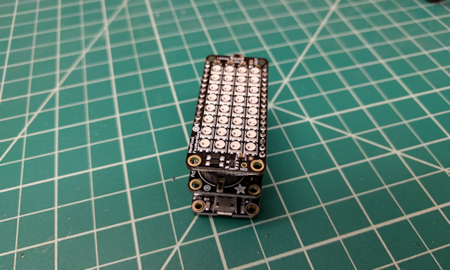

# Arduino Glowing Pumpkin (Feather, Timer)

<!-- toc -->

* [Introduction](#introduction)
* [Component List](#component-list)
* [Assembly](#assembly)
* [Configuring Your Development Environment](#configuring-your-development-environment)
* [Getting the Project Code](#getting-the-project-code)
* [Installing the Code](#installing-the-code)
* [About the Code](#about-the-code)
  * [Configuring Wi-Fi Settings](#configuring-wi-fi-settings)
  * [Defining Colors](#defining-colors)
  * [Setup](#setup)
  * [Main Loop](#main-loop)
* [Final Assembly](#final-assembly)

<!-- toc stop -->

## Introduction

Last year, I created a cool [Arduino-powered Glowing Pumpkin](https://github.com/johnwargo/Arduino-Glowing-Pumpkin) project for Halloween. I used a Neopixel ring and an Arduino to display random colors inside a foam pumpkin. I built several of them, and placed one in each dormer window in my house. they work great. I've always wanted to do something bigger, but I never found a big enough pumpkin to use for this. This year, while picking up some supplies at Home Depot, I found the perfect pumpkin for an updated (larger) version of the project.

As you can see from the following picture, it's a pretty big pumpkin; that's a quart paint can to the right of it.

For lighting, I had to think bigger. Since this was a much larger pumpkin to illuminate, I had to go beyond the simple NeoPixel ring. For this project, I used the Adafruit NeoPixel FeatherWing, a 8x4 array of bright, tri-color LEDs (that's 32 LEDs for those of you who are mathematically challenged). I then paired the NeoPixel FeatherWing with the Adafruit Feather HUZZAH since I wanted to do something interesting on the network for this version of the project.

So, there are two versions of the project:

+	The [Feather HUZZAH and NeoPixel FeatherWing](../glowing-pumpkin-feather/readme.md) version of the project. This version simply illuminates the pumpkin with bright lights, cycling through multiple colors over time.
+ The Feather HUZZAH, NeoPixel FeatherWing, and Adalogger FeatherWing version. This version of the project does the same things as the other versions, but for this version, I used a real-time clock FeatherWing and the Feather's Wi-Fi network connection to connect to a time server, update the board's clock with the correct time, then turn the NeoPixels on and off on a predetermined schedule (set by you in the project's code). How cool is that?  You're looking at this version of the project.

## Component List

For this version of the project, I used the following hardware:

+ [Adafruit Feather HUZZAH with ESP8266 WiF](https://www.adafruit.com/product/2821)
+ [Adalogger FeatherWing - RTC](https://www.adafruit.com/product/2922)
+ [NeoPixel FeatherWing](https://www.adafruit.com/product/2945)
+ [Feather Header Kit - 12-pin and 16-pin Female Header Set](https://www.adafruit.com/product/2886)
+ [Feather Stacking Headers - 12-pin and 16-pin female headers](https://www.adafruit.com/product/2830)
+ [5V 2.4A Switching Power Supply with 20AWG MicroUSB Cable](https://www.adafruit.com/product/1995)
+ A huge, plastic pumpkin
+ Strips of self-adhesive Velcro 
+ One 2' x 2' piece of 3/4 in plywood, painted black

## Assembly

Assembling the project is easy since all of the components stack on top of each other. When you're done, you'll stack the components together with the Feather on the bottom, the Adalogger in the middle, and the NeoPixel FeatherWing on top (you want the LEDs clearly visible on top of the stack). 

1.	The stacking headers are female headers with longer pins, they'll enable you to stack the NeoPixel FeatherWing on top of the Adalogger FeatherWing, while also stacking the Adalogger FeatherWing on top of the Feather HUZZAH. Take a moment to lay out all of the project parts as shown in the following figure.

	
 
2.	Now, complete the assembly instructions for the [Feather HUZZAH and NeoPixel FeatherWing](../glowing-pumpkin-feather/readme.md) project. Once those steps are complete, return here for further instructions.

3.	Insert the stacking header pins through the top of the Adalogger FeatherWing, then flip the device over and solder the pins on the bottom of the board. Make sure to insert the pins in the **outside** pin holes on the board.  

4.	When you're done, you should be able to stack the components together like this:

	

	The Feather HUZZAH goes on the bottom, put the Adalogger FeatherWing in the middle, and the NeoPixel FeatherWing on top.
 
## Configuring Your Development Environment

To upload the project code to the Feather HUZZAH, you have to install some special software drivers and some additional software in the Arduino IDE. I could tell you how to do this, but the folks at Adafruit have already published the instructions in the [Adafruit Feather HUZZAH ESP8266 Tutorial](https://learn.adafruit.com/adafruit-feather-huzzah-esp8266/using-arduino-ide).

Go there, follow the instructions, then come back here.

## Getting the Project Code

The code for this project is available on [Github](https://github.com/johnwargo/glowing-pumpkin-feather). Download the project files and extract them to a folder somewhere. 

If you have `git` installed (its installed automatically on macOS, but on Windows you'll have to install it from [https://git-scm.com/](https://git-scm.com/). Next, open a terminal window, navigate to the folder where you put the files and execute the following command:

	git clone https://github.com/johnwargo/glowing-pumpkin-feather

Git will download and extract the files to a folder called `glowing-pumpkin-feather`.

## Installing the Code
 
Open the Arduino IDE, then open the project's `glowing-pumpkin-feather.ino` file. If you used the same hardware as I did, the code is already configured for your hardware configuration, so just connect the Feather HUZZAH to the computer using a USB cable then upload the code to the device. That's all there is to it.   

If you configured the NeoPixel FeatherWing to use a different pin, then you'll need to make one change to the code. Look for the following code in the project sketch:

	/**************************************************************************
	   Specify the Feather pin the NeoPixel is connected to.
	   According to the guide at:
	   https://learn.adafruit.com/adafruit-neopixel-uberguide/neopixel-shields
	   "The NeoPixels are normally controlled from digital pin 6, but pads on
	   the bottom make this reassignable. In particular, the default pin for
	   Feather Huzzah ESP8266 must be moved, try pin #15!"
	   As we're using the Huzzah, we'll make this 15.
	 **************************************************************************/
	#define PIN 15

Change the `15` in the last line to the appropriate pin for your hardware implementation. Save your changes to the project and upload it to the Feather HUZZAH. 

## About the Code

### Configuring Wi-Fi Settings

The Feather HUZZAH must connect to the Internet to set the time on the RTC board; in order to do that, it must be able to connect to your local Wi-Fi network. In the Arduino IDE, open the project's `wi-fi-config.h` file, it will look something like this:   

	// Populate the defines below with the settings for your Wi-Fi network
	// Network SSID (name)
	#define wifi_ssid ""
	// SSID password (use for WPA, or use as key for WEP)
	#define wifi_pass ""

Populate the `wifi_ssid` value with the name of your local Wi-Fi network. This will be the network name you'll see in your smartphone's Wi-Fi setup screen. Next, populate the `wifi_pass` value with the passcode for your local Wi-Fi network. As an example, if your local Wi-Fi network is called `My Network` and the network passcode is `Some super silly passcode`, then your `wi-fi-settings.h` would look like the following:

	// Populate the defines below with the settings for your Wi-Fi network
	// Network SSID (name)
	#define wifi_ssid "My Network"
	// SSID password (use for WPA, or use as key for WEP)
	#define wifi_pass "Some super silly passcode"

Save your changes to the file.

Next, open the project's `glowing-pumpkin-feather-timer.ino` file and look for the following code:

	//Set the time zone using the time zones listed in constants.h.
	//You'll have to manually switch the device from standard time to daylight
	//time during the summer if you live in an area that observes daylight time.
	const int timeZone = EDT;

Populate the `timezone` value with the appropriate timezone code for your current location. The list of valid timezone codes can be found in the project's `constants.h` file. I didn't list all the valid timezones in there, so if yours isn't listed, you're going to have to add it there before making the change in the `glowing-pumpkin-feather-timer.ino` file. 

Save your changes to the file.

### Configuring On and Off Times

The sketch uses the `slots` array to define a series of on/off times for the project. Populate the array with the appropriate values for your environment. The project comes configured by default to turn the LEDs on at 6 AM and off at 8:00 AM; this corresponds to a slots array row containing `600, 800`. It turns them on again at 7:00 PM and off at 11:00 PM, corresponding to a slots array row containing `1900, 2100`.

	//Populate the following variable with the number of rows in the slots array
	//I'm doing this way because Arduino doesn't have an easy way to determine
	//the size of an array at runtime, especially multidimensional arrays.
	#define NUMSLOTS 2
	//Use the Slots array to define when the relay(s) go on and off
	//Slots array values: {onTime, offTime };
	// Examples:
	// Turn the relay on at 6:00 AM, turn it off 8:00 AM
	// { 600, 800 },
	// Turn the relay on at 5:00 PM turn it off at 11:00 PM.
	// {1700, 2300}
	// Turn the relay on at 5:30 AM, turn the relay off at 7:00 AM.
	// {530, 700}
	int slots[NUMSLOTS][2] = {
	  {600, 800},
	  {1900, 2100}
	  //BE SURE TO UPDATE THE NUMSLOTS CONSTANT IF YOU ADD/REMOVE
	  //ROWS FROM THIS ARRAY
	};

You can configure as many on/off times as you want, you just have to make sure they're valid times and they don't overlap each other. The sketches setup code validates the `slots` settings, so run the project the first time with the Arduino IDE's Serial Monitor on so you can see any error messages that come through. 

If you add or remove any `slots` rows, you must adjust the value in the `NUMSLOTS` to match the number of rows.

### Defining Colors

The colors the project uses are defined in the following code:

	// color definitions
	uint32_t cBlue = pixels.Color(0, 0, 255);
	uint32_t cGreen = pixels.Color(0, 255, 0);
	uint32_t cNone = pixels.Color(0, 0, 0);
	uint32_t cOrange = pixels.Color(255, 128, 1);
	uint32_t cPurple = pixels.Color(128, 0, 128);
	uint32_t cRed = pixels.Color(255, 0, 0);
	uint32_t cWhite = pixels.Color(255, 255, 255);
	uint32_t cYellow = pixels.Color(255, 215, 0);
	
	////colors is an array of all of the colors
	int numColors = 7;
	uint32_t colors[] = {cBlue, cGreen, cOrange, cPurple, cRed, cWhite, cYellow};

If you want to change the colors displayed or add/remove colors, you'll need to do a few things.

To add a color, define a new color constant (`cIndigo` for example) and add it to the color definitions list. Next, you'll need to change the value in the `numColors` variable to match the number of colors used in the project. Finally, update the `colors` array adding your new color to the list.

To remove a color, simply reduce the number in `numColors` and remove the color value from the `colors` array.

### Sketch Logic

Normally I'd explain the rest of the project's code, but its pretty involved and should be well documented within the sketch. Spend some time looking through the code so you'll understand what's happening. 

When you're all set, upload the sketch to the Feather HUZZAH and you're all set.

## Final Assembly

From a mounting standpoint, I painted the board black and used the Velcro strips to stick the pumpkin to the board. Its often windy here around Halloween, so I needed to make sure the assembly didn't blow away. Be sure to place the Feather/FeatherWing combo inside the pumpkin with the LEDs facing up and the power cord passed through the back before you seal everything up.

The LEDs are pretty bright (I wanted them that way); I'm thinking of putting a frosted globe or bowl over the assembly to diffuse the light.

Another option is to use the NeoPixel library's `setBrightness()` method to tone down the brightness a little. The method takes a brightness percentage as a parameter, so to set brightness at 50%, you would use the following code:

	pixels.setBrightness(.5);

**Note:** you can only call `setBrightness()` once and you must call it at the very beginning of the sketch. Refer to the NeoPixels documentation for details.

***

If you find this code useful, and feel like thanking me for providing it, please consider making a purchase from [my Amazon Wish List](https://amzn.com/w/1WI6AAUKPT5P9). You can find information on many different topics on my [personal blog](http://www.johnwargo.com). Learn about all of my publications at [John Wargo Books](http://www.johnwargobooks.com).