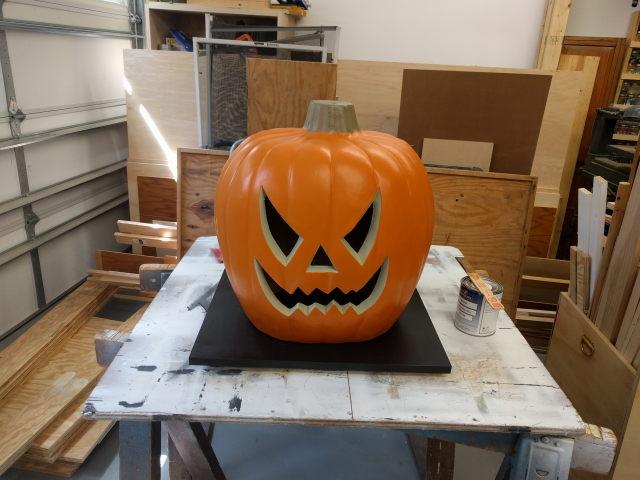
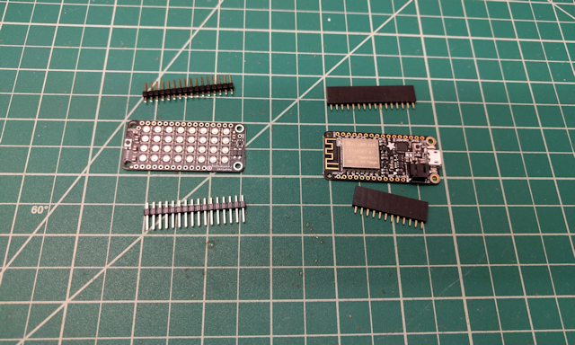
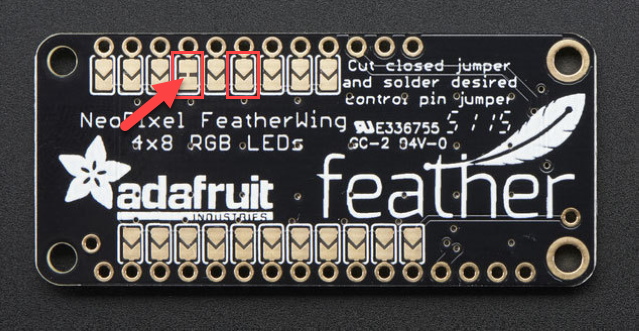
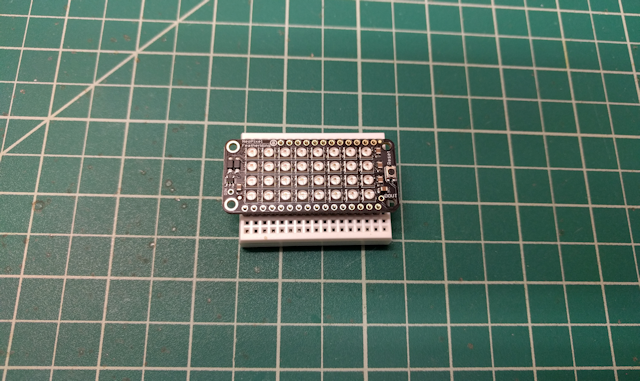
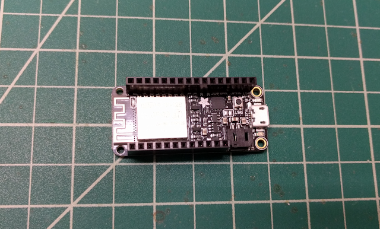
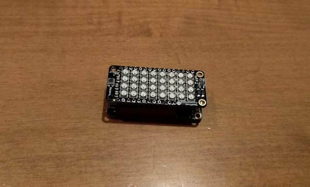

# Arduino Glowing Pumpkin (Adafruit Feather)

<!-- toc -->

* [Introduction](#introduction)
* [Component List](#component-list)
* [Hardware Assembly](#hardware-assembly)
* [Configuring Your Development Environment](#configuring-your-development-environment)
* [Getting the Project Code](#getting-the-project-code)
* [Installing the Code](#installing-the-code)
* [About the Code](#about-the-code)
  * [Defining Colors](#defining-colors)
  * [Setup](#setup)
  * [Main Loop](#main-loop)
* [Final Assembly](#final-assembly)

<!-- toc stop -->

## Introduction

Last year, I created a cool [Arduino-powered Glowing Pumpkin](https://github.com/johnwargo/Arduino-Glowing-Pumpkin) project for Halloween. I used a Neopixel ring and an Arduino to display random colors inside a foam pumpkin. I built several of them, and placed one in each dormer window in my house. they work great. I've always wanted to do something bigger, but I never found a big enough pumpkin to use for this. This year, while picking up some supplies at Home Depot, I found the perfect pumpkin for an updated (larger) version of the project.

As you can see from the following picture, it's a pretty big pumpkin; that's a quart paint can to the right of it.

For lighting, I had to think bigger. Since this was a much larger pumpkin to illuminate, I had to go beyond the simple NeoPixel ring. For this project, I used the Adafruit NeoPixel FeatherWing, a 8x4 array of bright, tri-color LEDs (that's 32 LEDs for those of you who are mathematically challenged). I then paired the NeoPixel FeatherWing with the Adafruit Feather HUZZAH since I wanted to do something interesting on the network.

So, there are two versions of the project:

+	The Feather HUZZAH and NeoPixel FeatherWing version of the project. This version simply illuminates the pumpkin with bright lights, cycling through multiple colors over time. You're looking at this version of the project.
+ The [Feather HUZZAH, NeoPixel FeatherWing, and Adalogger FeatherWing](../glowing-pumpkin-feather-timer/readme.md) version. This version of the project does the same things as the other versions, but for this one, I used a real-time clock FeatherWing and the Feather's Wi-Fi network connection to connect to a time server, update the board's clock with the correct time, then turn the NeoPixels on and off on a predetermined schedule (set by you in the project's code). How cool is that?

## Component List

For this project, I used the following hardware:

+ [Adafruit Feather HUZZAH with ESP8266 WiF](https://www.adafruit.com/product/2821).
+ [NeoPixel FeatherWing](https://www.adafruit.com/product/2945).
+ [Feather Stacking Headers - 12-pin and 16-pin female headers](https://www.adafruit.com/product/2830) - Needed so you can stack the FeatherWing on the Feather. 
+ [5V 2.4A Switching Power Supply with 20AWG MicroUSB Cable](https://www.adafruit.com/product/1995)
+ A huge, plastic pumpkin - as big as you can find.
+ Strips of self-adhesive Velcro.
+ One 2' x 2' piece of 3/4 in plywood, painted black.

## Hardware Assembly

Assembling the project is easy since all of the components stack on top of each other. When you're done, you'll stack the components together with the Feather on the bottom, and the NeoPixel FeatherWing on top (you want the LEDs clearly visible on top of the stack).

1.	First lets layout the parts we're going to need; we're cannibalizing parts from the Feather for the FeatherWing. Take the male headers from the Feather, and put them with the NeoPixel FeatherWing. These are the headers that will be used to mount the NeoPixel FeatherWing on top of the Feather HUZZAH. Next, take the female stacking headers and put them with the Feather HUZZAH. 
	
	When you're done, your setup should look like the following figure.
	
	

2.	On the underside of the NeoPixel FeatherWing, there are a series of pin traces you can use to configure which pin your application will control the NeoPixel array (shown in the following figure). 

	

	According to the [documentation](https://learn.adafruit.com/adafruit-neopixel-featherwing/pinouts): 
	
	*"The NeoPixels are normally controlled from digital pin 6, but pads on the bottom make this reassignable. In particular, the default pin for Feather Huzzah ESP8266 must be moved, try pin #15!"*

	Since we're using the Feather HUZZAH, we're going to have to make this change. If you selected a different microcontroller for your project, feel free to skip the rest of this step. 

	Looking at the top left corner of the board shown in the figure, the 4th pin trace from the left (highlighted in the figure with an arrow) has a little snippet of metal connecting the two pads. This is the pin 6 the documentation was referring to. Using a knife, cut through that little connection between two pads, disconnecting them. Then, two pins over to the right (highlighted with a red box [no arrow] in the figure) connect the two pads with a bead of solder.

3.	On the NeoPixel FeatherWing; Insert the male headers into the pin sockets on the underside of the FeatherWing. The shorter ends of the headers will push up through the top of the board.
	
	Now, insert the assembly into a breadboard; this stabilizes the pins as you begin to solder the headers onto the board. At this point, it should look like the following figure. Solder each of the header pins on top of the FeatherWing.

	

4.	Insert the female headers into the pins on the top of the Feather HUZZAH. Flip the board over and solder the header pins against the bottom of the board.  

	

5.	Gently place the NeoPixel FeatherWing on top of the Feather HUZZAH, lining up the NeoPixel FeatherWing's Male headers with the Feather HUZZAH's female headers. Gently press the boards together to seat the NeoPixel FeatherWing against the top of the Feather.

	

That's it, hardware assembly completed.

## Configuring Your Development Environment

To upload the project code to the Feather HUZZAH, you have to install some special software drivers and some additional software in the Arduino IDE. I could tell you how to do this, but the folks at Adafruit have already published the instructions in the [Adafruit Feather HUZZAH ESP8266 Tutorial](https://learn.adafruit.com/adafruit-feather-huzzah-esp8266/using-arduino-ide).

Go there, follow the instructions, then come back here.

## Getting the Project Code

The code for this project is available on [Github](https://github.com/johnwargo/glowing-pumpkin-feather). Download the project files and extract them to a folder somewhere. 

If you have `git` installed (its installed automatically on macOS, but on Windows you'll have to install it from [https://git-scm.com/](https://git-scm.com/). Next, open a terminal window, navigate to the folder where you put the files and execute the following command:

	git clone https://github.com/johnwargo/glowing-pumpkin-feather

Git will download and extract the files to a folder called `glowing-pumpkin-feather`.

## Installing the Code
 
Open the Arduino IDE, then open the project's `glowing-pumpkin-feather.ino` file. If you used the same hardware as I did, the code is already configured for your hardware configuration, so just connect the Feather HUZZAH to the computer using a USB cable then upload the code to the device. That's all there is to it.   

If you configured the NeoPixel FeatherWing to use a different pin, then you'll need to make one change to the code. Look for the following code in the project sketch:

	/**************************************************************************
	   Specify the Feather pin the NeoPixel is connected to.
	   According to the guide at:
	   https://learn.adafruit.com/adafruit-neopixel-uberguide/neopixel-shields
	   "The NeoPixels are normally controlled from digital pin 6, but pads on
	   the bottom make this reassignable. In particular, the default pin for
	   Feather Huzzah ESP8266 must be moved, try pin #15!"
	   As we're using the Huzzah, we'll make this 15.
	 **************************************************************************/
	#define PIN 15

Change the `15` in the last line to the appropriate pin for your hardware implementation. Save your changes to the project and upload it to the Feather HUZZAH. 

## About the Code

### Defining Colors

The colors the project uses are defined in the following code:

	// color definitions
	uint32_t cBlue = pixels.Color(0, 0, 255);
	uint32_t cGreen = pixels.Color(0, 255, 0);
	uint32_t cNone = pixels.Color(0, 0, 0);
	uint32_t cOrange = pixels.Color(255, 128, 1);
	uint32_t cPurple = pixels.Color(128, 0, 128);
	uint32_t cRed = pixels.Color(255, 0, 0);
	uint32_t cWhite = pixels.Color(255, 255, 255);
	uint32_t cYellow = pixels.Color(255, 215, 0);
	
	////colors is an array of all of the colors
	int numColors = 7;
	uint32_t colors[] = {cBlue, cGreen, cOrange, cPurple, cRed, cWhite, cYellow};

If you want to change the colors displayed or add/remove colors, you'll need to do a few things.

To add a color, define a new color constant (`cIndigo` for example) and add it to the color definitions list. Next, you'll need to change the value in the `numColors` variable to match the number of colors used in the project. Finally, update the `colors` array adding your new color to the list.

To remove a color, simply reduce the number in `numColors` and remove the color value from the `colors` array.

### Setup

The application's `setup` function initializes the NeoPixel library and the random number generator. The random number generator is used to randomly pick a color from the `colors` array every time the sketch goes through the loop.  

	void setup() {
	  // Initialize the NeoPixel library
	  pixels.begin();
	  // show any lights that should be on (in this case, none)
	  pixels.show();
	
	  //Initialize the random number generator with a random seed pulled from
	  //analog pin #3
	  randomSeed(analogRead(3));
	}

There's nothing you should really need to change here. 

### Main Loop

The main loop in the application picks a number between 0 and 10, and if the number is greater than 8, it kicks off the `flicker()` function (described later). If less than 8, it picks a random color from the colors array and calls the `rotateLights()` function to cycle the ring's LEDs to the selected color.  

	void loop() {
	  //generate a random integer between 1 and 10
	  //  if it's a 9 or a 10, ...
	  if ((int)random(11) > 8) {
	    //do that flicker thing
	    flicker();
	  } else {
	    //otherwise, pick a random color and set each pixel individually to that color
	    //with a random time delay between setting each pixel
	    stepLights(colors[(int)random(1, numColors + 1)], (int)random(50, 500));
	  }
	}

The code generates a random number from 1 to 10. If the number is a 9 or a 10, it flashes the LEDs white (`cWhite`) using the `flicker` function, otherwise, it picks a random color and fades the NeoPixel array to that new color (using the `stepLights` function).

The `flicker()` function sets the NeoPixel array's LEDs to white then flickers them a random number of times, each for a random duration. The `flashCount` variable is set to an integer between 1 and 7 used as a loop counter for the flashes. The function sets a random value that controls how long the lights stay on as well as another random value to control how long of a pause there is between flashes. The end result is that it looks like a short or something is causing a white sparks or lightning every so often. Pretty cool, eh?

	void flicker() {
	  // how many times are we going to flash?
	  int flashCount = (int)random(1, 7);
	  //flash the lights in white flashCount times
	  //with a random duration and random delay between each flash
	  for (int i = 0; i < flashCount; i++) {
	    // Set all pixels to white and turn them on
	    setColor(cWhite);
	    // Delay for a random period of time (in milliseconds)
	    delay((int)random(50, 150));
	    //clear the lights (set the color to none)
	    setColor(cNone);
	    // Delay for a random period of time (in milliseconds)
	    delay((int)random(100, 500));
	  }
	}

Finally, the `stepLights()` function, sets the NeoPixel array's LEDs to a single color sequentially (a column at a time), pausing a random amount of time between each row (the same delay between each LED changing color, but a different delay every time the function is called). The function doesn't turn off the lights when it's done, so it has the effect of the ring's lights transitioning from one random color to another. So, it looks like a sort of two-color glow every time the function is called.  

	//Set a single color one column at a time across the array.
	//Used to 'fade' into a new color
	void stepLights(uint32_t c, int delayVal) {
	  //Loop through all of the columns
	  for (int i = 0; i < NUMCOLUMNS; i++) {
	    //Set a column to the new color
	    for (int j = 0; j < NUMROWS; j++) {
	      pixels.setPixelColor(i + (j * NUMCOLUMNS), c);
	    } //for j
	    //Display the new row color
	    pixels.show();
	    //wait for the specified period of time (in milliseconds)
	    delay(delayVal);
	  }  //for i  
	}

No effort is made to pass `stepLights()` a different color every time its called, so its possible lights will stay the same color longer.

## Final Assembly

From a mounting standpoint, I painted the board black and used the Velcro strips to stick the pumpkin to the board. Its often windy here around Halloween, so I needed to make sure the assembly didn't blow away. Be sure to place the Feather/FeatherWing combo inside the pumpkin with the LEDs facing up and the power cord passed through the back before you seal everything up.

The LEDs are pretty bright (I wanted them that way); I'm thinking of putting a frosted globe or bowl over the assembly to diffuse the light.

Another option is to use the NeoPixel library's `setBrightness()` method to tone down the brightness a little. The method takes a brightness percentage as a parameter, so to set brightness at 50%, you would use the following code:

	pixels.setBrightness(.5);

**Note:** you can only call `setBrightness()` once and you must call it at the very beginning of the sketch. Refer to the NeoPixels documentation for details.

***

If you find this code useful, and feel like thanking me for providing it, please consider making a purchase from [my Amazon Wish List](https://amzn.com/w/1WI6AAUKPT5P9). You can find information on many different topics on my [personal blog](http://www.johnwargo.com). Learn about all of my publications at [John Wargo Books](http://www.johnwargobooks.com).