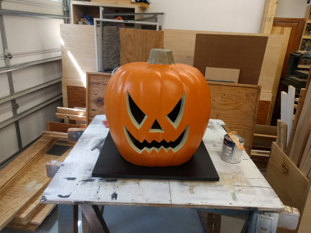

# Arduino Glowing Pumpkin (Adafruit Feather)

Last year, I created a cool [Arduino-powered Glowing Pumpkin](https://github.com/johnwargo/Arduino-Glowing-Pumpkin) project for Halloween. I used a NeoPixel ring and an Arduino to display random colors inside a foam pumpkin. I built several of them, and placed one in each dormer window in my house. they work great. I've always wanted to do something bigger, but I never found a big enough pumpkin to use for this. This year, while picking up some supplies at Home Depot, I found the perfect pumpkin for an updated (larger) version of the project.

As you can see from the following picture, it's a pretty big pumpkin; that's a quart paint can to the right of it.

For lighting, I had to think bigger. Since this was a much larger pumpkin to illuminate, I had to go beyond the simple NeoPixel ring. For this project, I used the Adafruit NeoPixel FeatherWing, a 8x4 array of bright, tri-color LEDs (that's 32 LEDs for those of you who are mathematically challenged). I then paired the NeoPixel FeatherWing with the Adafruit Feather HUZZAH since I wanted to do something interesting on the network for a version of this (coming soon).

The `glowing-pumpkin-feather` contains the initial sketch for this project, a simple application that illuminates the pumpkin with a random set of colors. Later, I'll add a version that uses a real-time clock and the Feather HUZZAH's network connection to keep time, then start and stop the NeoPixel FeatherWing at predetermined times. 

***

If you find this code useful, and feel like thanking me for providing it, please consider making a purchase from [my Amazon Wish List](https://amzn.com/w/1WI6AAUKPT5P9). You can find information on many different topics on my [personal blog](http://www.johnwargo.com). Learn about all of my publications at [John Wargo Books](http://www.johnwargobooks.com).